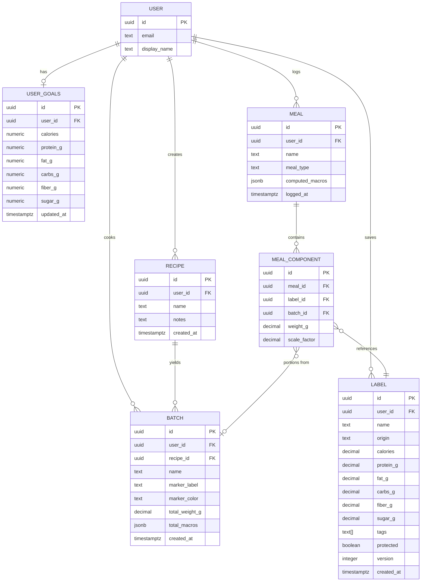
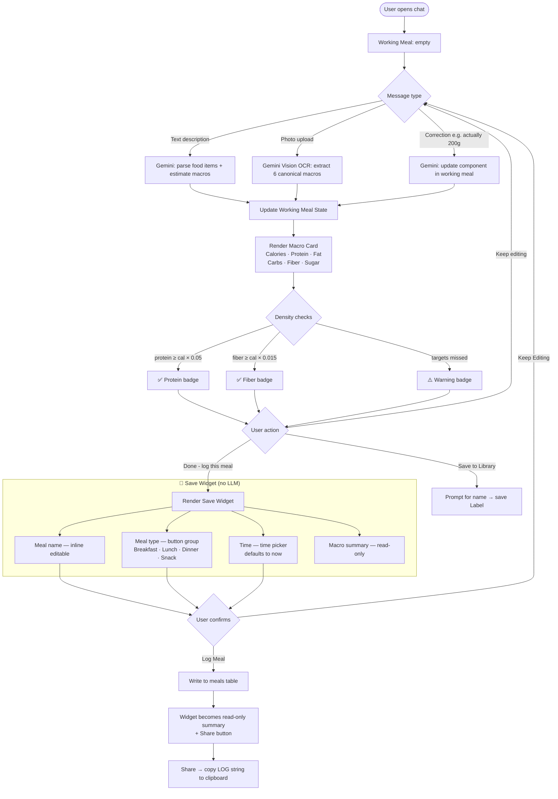
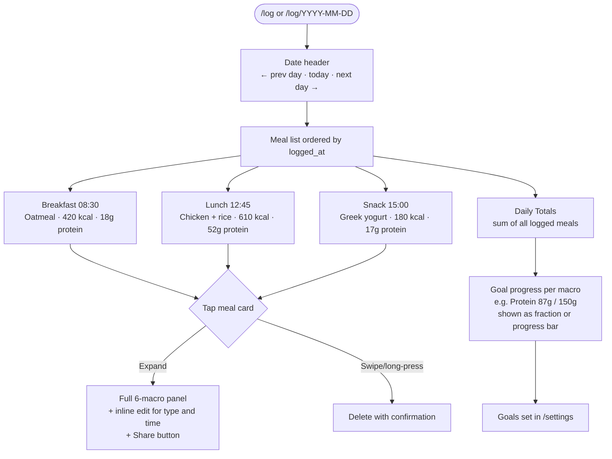
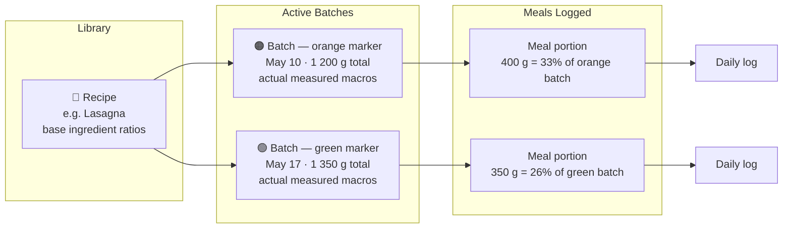
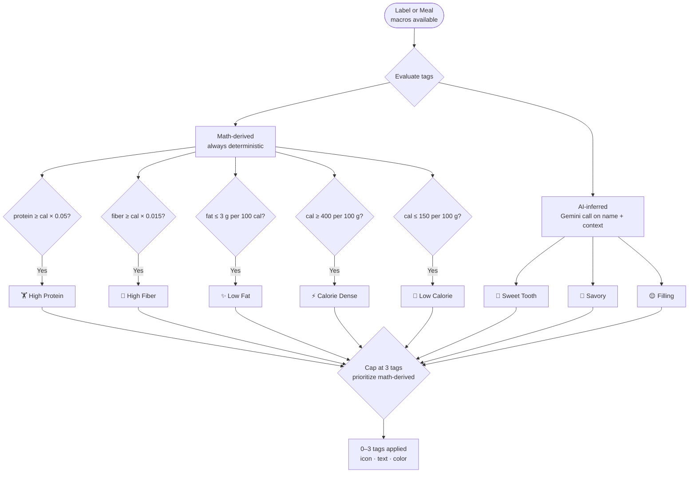

# Architecture Diagrams

---

## 1. Data Model (Entity Relationships)

> `meal_type` is an enum: `breakfast | lunch | dinner | snack`
> `USER_GOALS` has one row per user (upsert on save). All fields nullable — goals are opt-in per macro.

---

## 2. Chat Flow (Working Meal → Save Widget → Log)

> **Key principle:** meal type and time edits inside the Save Widget never go through the LLM. They are direct UI interactions that update local state only.

---

## 3. Daily Log Page

---

## 4. Recipe → Batch → Portion Flow

> **Physical labeling convention:** Write the marker color on the ziploc bag in real life, select the same color in-app. Batches of the same recipe are unambiguous at a glance.

---

## 5. Auto-Tag System

> **Note on tag taxonomy:** The specific tags, thresholds, icons, and colors above are proposals — see [#27](https://github.com/rickcedwhat/julia-learn/issues/27) to finalize before implementation.

---

## 6. Label Origin Types

| Origin | How it's created | Trust level |
|---|---|---|
| `verified_label` | Photo of nutrition facts panel → Gemini OCR | Highest — direct from packaging |
| `user_generated` | User builds a recipe from other labels | Medium — math is exact, ingredients are user-chosen |
| `ai_estimated` | No photo available; Gemini estimates from item name | Lowest — useful as fallback, flagged visually |
