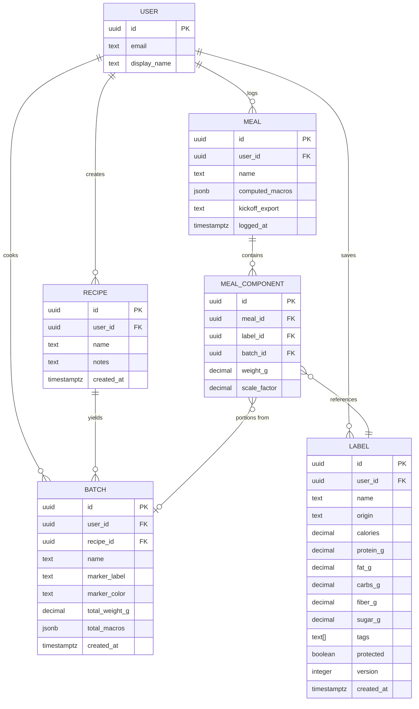
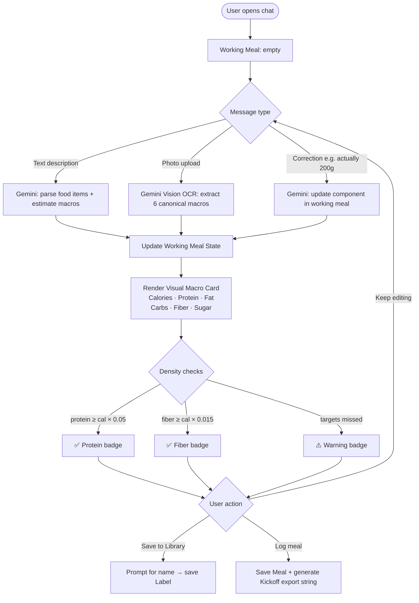
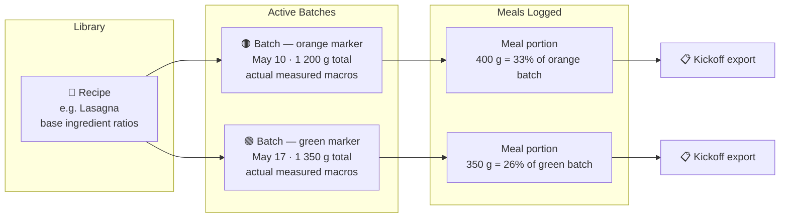

# Architecture Diagrams

---

## 1. Data Model (Entity Relationships)

---

## 2. Chat Flow (Working Meal → Log / Save)

---

## 3. Recipe → Batch → Portion Flow

> **Physical labeling convention:** Write the marker color on the ziploc bag in real life, select the same color in-app. Batches of the same recipe are unambiguous at a glance.

---

## 4. Auto-Tag System

> **Note on tag taxonomy:** The specific tags, thresholds, icons, and colors above are proposals — see issue #25 to finalize before implementation.

---

## 5. Label Origin Types

| Origin | How it's created | Trust level |
|---|---|---|
| `verified_label` | Photo of nutrition facts panel → Gemini OCR | Highest — direct from packaging |
| `user_generated` | User builds a recipe from other labels | Medium — math is exact, ingredients are user-chosen |
| `ai_estimated` | No photo available; Gemini estimates from item name | Lowest — useful as fallback, flagged visually |
